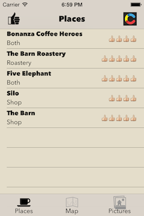
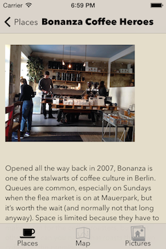
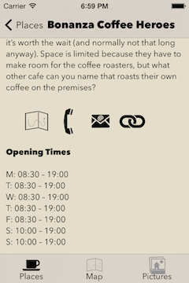
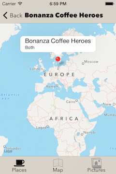

# Guide app

A generic app for shop guides, styled as a guide to Coffee places.
Supports iOS 7 and uses [Contentful][1] as CMS for the guides.

**This app was made during an internal hackathon and is not officially supported.**

### Screenshots

    

### Acknowledgements

- Icons are taken from [The Noun Project][2] and are Public Domain.
- The app icon is also based on a Public Domain image from [The Noun Project][2].
- The splash screen is cut out of [a photo][3] by [James Skivington][5], licensed
under [Creative Commons][4].
- The app uses the [ContentfulDeliveryAPI][6], [CPDAcknowledgements][7] and
[PDKTCollectionViewWaterfallLayout][8].
- Thanks to [Tiago][9] for creating the example data, also look at
[his implementation][10] of a similar app.

[1]: https://www.contentful.com
[2]: http://thenounproject.com
[3]: http://www.flickr.com/photos/jamesskivington/4575745224/
[4]: http://creativecommons.org/licenses/by/2.0/deed.en
[5]: http://www.flickr.com/photos/jamesskivington/
[6]: https://github.com/contentful/contentful.objc
[7]: https://github.com/CocoaPods/CPDAcknowledgements
[8]: https://github.com/Produkt/PDKTCollectionViewWaterfallLayout
[9]: https://github.com/trodrigues
[10]: https://github.com/contentful/guide-app
